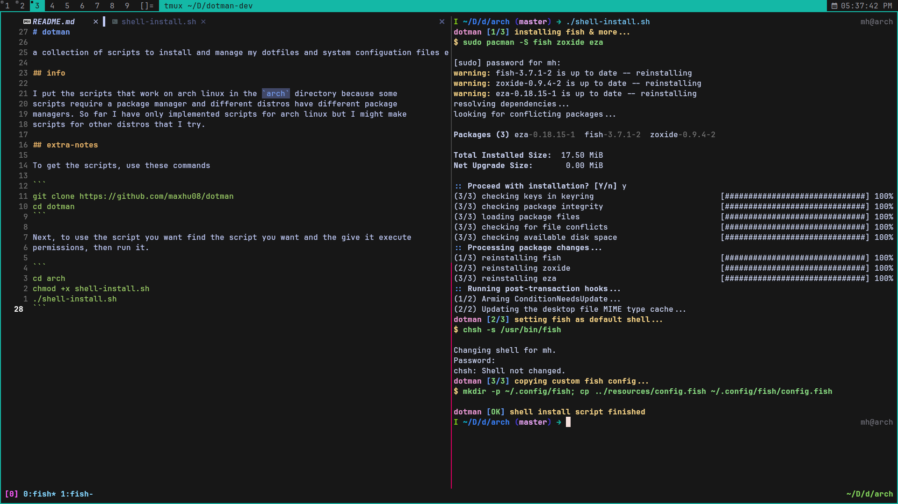

# dotman

a collection of scripts to install and manage my dotfiles and system configuation files easily

## info

I put the scripts that work on arch linux in the `arch` directory because some
scripts require a package manager and different distros have different package
managers. So far I have only implemented scripts for arch linux but I might make
scripts for other distros that I try.

## extra-notes

To get the scripts, use these commands

```
git clone https://github.com/maxhu08/dotman
cd dotman
```

Next, to use the script you want find the script you want and the give it execute
permissions, then run it.

```
cd arch
chmod +x shell-install.sh
./shell-install.sh
```

## showcase


